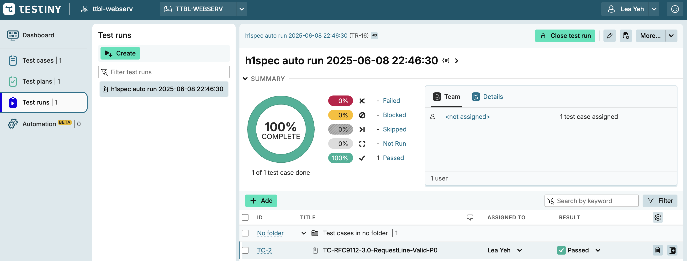
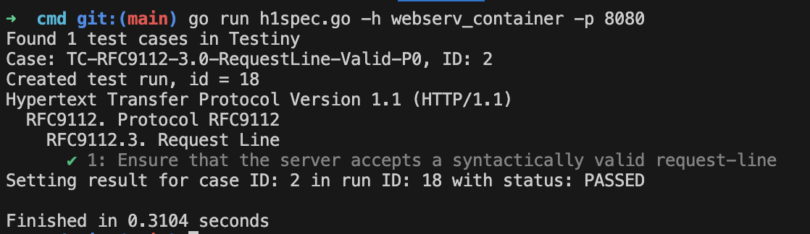

**Questions about Collaboration between Testiny.io and the Tester Tool**

Currently, Testiny.io’s main entities are:

1. **Test Plan**
2. **Test Case**
3. **Test Run**

**This is my current understanding—please help me confirm if it’s correct or suggest improvements:**

---

### **Manual Testing Process (without automation):**

1. **Create a Test Plan**

   * Since the fields and structure in Testiny.io are relatively basic, I first define the complete test specification in documentation (for example, [the request line test specification](https://github.com/42-CC-RNCP/TBLL-WEBSRV/blob/main/test_plan/rfc9112_message_syntax/3_request_line.md)).
   * I then manually create the corresponding Test Plan in Testiny.io according to the documentation.
2. **Add Test Cases**

   * Under the Test Plan, I create and add individual Test Cases for each requirement or test point.
3. **Manual Test Run and Result Recording**

   * I manually create a Test Run entry, execute each Test Case, and manually record the result (pass/fail, bug reporting, etc.) for each case.

---

### **Automated Tester Integration Flow:**

1. **Steps for Test Plan and Test Case remain unchanged** (same as the manual process).
2. **Automate Test Run and Result Recording**

   * My tester tool (e.g., a CLI application) uses the Testiny.io RESTful API to automatically create a Test Run entry.
   * The test results (for each case in that iteration) are then automatically pushed to the Test Run entry, instead of being recorded manually.

---

### **Current Status:**

* I have created one Test Plan and one Test Case, implemented the same Test Case in my automated tester, and can now use the API to automatically create a Test Run and push the results to Testiny.io.
* The creation and maintenance of documentation and Testiny.io (Test Plan/Test Case) are still manual; only the execution and reporting are automated.

---

### **My concrete questions:**

1. Is my understanding correct? Is Testiny.io mainly designed for manual maintenance of Test Plan and Test Case, while Test Run execution and result recording can be automated via API?
2. In practice, do you recommend managing all detailed Test Plan/Case content in documentation (e.g., Markdown files in a repo), and using Testiny.io mainly as a tracking/management platform? Or do you have a better workflow suggestion?
